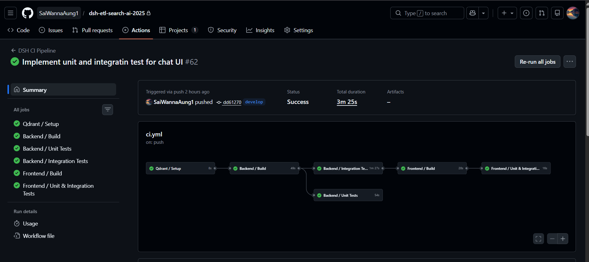


> *“During implementation, the system uses GitHub Actions to achieve Continuous Integration”*
> without going into pipeline internals.

Below is a **concise, professional wording** you can use in a README, report, or thesis.

---

## 🔄 Continuous Integration (CI) Approach

During implementation, the **DshETL system** adopts **Continuous Integration (CI)** using **GitHub Actions** to ensure code quality, stability, and repeatability throughout development.

The CI pipeline is automatically triggered on **code pushes and pull requests**, allowing every change to be validated in an isolated, reproducible environment.

---

## 🧪 CI Strategy Overview

The pipeline enforces the following principles:

* Automated build validation for backend and frontend components
* Continuous execution of unit and integration test
* Early detection of integration issues across services
* Infrastructure parity using containerized dependencies

This approach ensures that all changes are **continuously verified** before being merged into shared branches.

---

## ⚙️ Technology Stack Used for CI

| Area             | Technology                |
| ---------------- | ------------------------- |
| CI Platform      | GitHub Actions            |
| Backend Runtime  | .NET 10                   |
| Frontend Runtime | Node.js                   |
| Testing          | xUnit, Vitest, Playwright |
| Infrastructure   | Docker (Qdrant Vector DB) |

---

## ✅ Outcome

By integrating **GitHub Actions** into the development workflow, the DshETL system achieves a **robust Continuous Integration process**, where every code change is automatically built and tested, ensuring the system remains stable and production-ready throughout its lifecycle.

---

