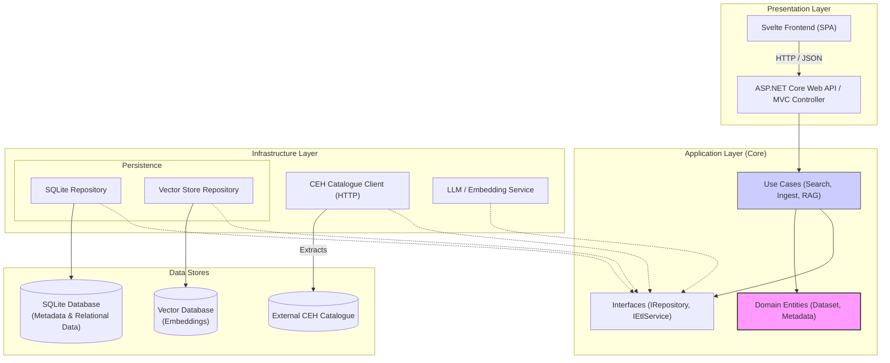

Based on the RSE-Coding-Task-2025.pdf requirements, I have designed a solution that adheres to Clean Architecture principles. This ensures the system is testable, extensible, and decouples the core business logic from external dependencies like the specific database or UI framework.

As requested, the backend will be C# (ASP.NET Core), serving a Svelte frontend, with SQLite for metadata and a Vector Database for semantic search.

### 1. High-Level System Architecture

This architecture follows the Onion (or Hexagonal) Architecture. The "Core" contains the business logic and domain entities and has no dependencies on the outer layers. The "Infrastructure" and "Presentation" layers depend on the Core.



### 2. Data Flow Diagram
This diagram illustrates how data moves from the external CEH source through the ETL process and how a user query flows through the system.

```mermaid
graph TD
%% ETL Flow
subgraph "ETL Process (Offline/Background)"
direction TB
WAF[("CEH Catalogue (WAF/Sitemap)")]
Downloader(Downloader Service)
Parser(Metadata Parser Strategy)
EmbeddingGen(Embedding Generator)

        WAF --"1. Crawl/Download"--> Downloader
        Downloader --"2. Zip/XML/JSON"--> Parser
        Parser --"3. Structured Metadata"--> SQL_Store[("SQLite DB")]
        
        Parser --"4. Title/Abstract/Docs"--> EmbeddingGen
        EmbeddingGen --"5. Vectors"--> Vec_Store[("Vector Store")]
    end

    %% Search Flow
    subgraph "Search & Discovery (Runtime)"
        direction TB
        User((User))
        SvelteUI["Svelte Web App"]
        SearchAPI["Search API Controller"]
        VectorSearch["Vector Search Engine"]
        LLM["LLM (RAG Chat)"]
        
        User --"6. Natural Language Query"--> SvelteUI
        SvelteUI --"7. API Request"--> SearchAPI
        
        SearchAPI --"8. Embed Query"--> EmbeddingGen
        EmbeddingGen --"9. Query Vector"--> VectorSearch
        
        VectorSearch --"10. Find Nearest Neighbors"--> Vec_Store
        Vec_Store --"11. Return IDs"--> VectorSearch
        
        VectorSearch --"12. Fetch Details"--> SQL_Store
        SQL_Store --"13. Dataset Metadata"--> SearchAPI
        
        SearchAPI --"14. JSON Response"--> SvelteUI
        
        %% Bonus RAG Flow
        SearchAPI --"15. Context + Query"--> LLM
        LLM --"16. Generated Answer"--> SvelteUI
    end
    
    linkStyle 0,1,2,3,4 stroke:#2ecc71,stroke-width:2px;
    linkStyle 5,6,7,8,9,10,11,12,13,14,15,16 stroke:#3498db,stroke-width:2px;
```
